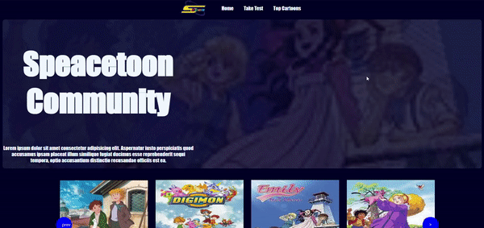

# SpeacetoonMemory
Take a trip down memory lane and relive the magic of the 90s with SpeacetoonMemorial. Immerse yourself in a nostalgic journey through a captivating memory test that evokes the essence of your childhood.
Simple Angular Application reprsents Basic Features used Like Slider , Timer , Routing , Services

- <a href="#usage">Usage </a>
- <a href="#screens">Screens </a>

# Run Project 

you will need to locate the root directory then write this command : npm i 
to run the project : ng serve 

## screens

  

  
  

